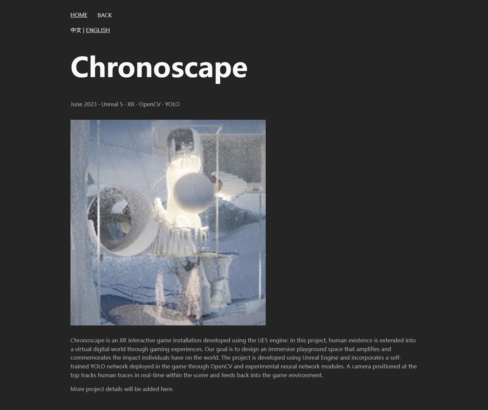

# 阶段 1：运行稳定性与部署路径

完成日期：2026-09-19。测试采集日期：2026-09-18（目录按采集日期保留）。

阶段 1 已完成；本次交付解决运行稳定性和部署寻址，响应式布局重构仍属于阶段 2。

## 实施结果

1. 移除首页 resize 整页刷新，使用容器 ResizeObserver 更新相机、renderer、composer 和效果分辨率。卡片 resize 监听与延迟计时器可以清理；固定页头暂用共享测量逻辑，后续由自然流布局替代。
2. 首页场景改为实例工厂，由 Vue 持有和销毁。取消重复初始化，清理动画帧、监听、观察器、renderer、composer、所有 pass 和模型资源。共享 geometry/material/texture 按引用去重释放；异步下载可中止，解析完成后的过期结果释放且不会重启动画。
3. WebGL 不可用、模型请求失败、模型格式错误和 context 丢失均切换静态封面。正文、导航不依赖模型成功加载。
4. public 资源统一通过 BASE_URL 辅助函数寻址，修复详情页直达时的相对路径问题；根路径与 `/Vite-Homepage-24/` 分别构建验证。
5. `/works/gcs` 成为可展示的独立详情页，使用已有封面和介绍，缺失正文明确显示待完善。HOME 明确回首页；BACK 在无有效站内历史时返回所属列表；补齐 404 和历史滚动恢复。
6. 保留 history URL，构建时为已知路由生成实体目录入口，同时生成 404.html。无需将旧链接迁移为 hash URL。
7. vue-i18n 升至兼容的 9.14.5，同步 npm/yarn 锁文件。本次审计为 0；9.x 已停止维护，后续仍需单独评估主版本迁移。

## 验证与证据

Windows，桌面 1440×900、手机视口 390×844，DPR 1。手机视口模拟不等同真机。

| 检查 | 结果 | 证据 |
| --- | --- | --- |
| Chrome 125.0.6422.113 | 36 正常通过、2 预期失败；无意外失败 | [原始报告](tests-chrome.json) |
| Edge 152.0.4191.66 | 36 正常通过、2 预期失败；无意外失败 | [原始报告](tests-edge.json) |
| 共享模型资源释放单元测试 | 1 项通过，跨对象与重复调用不重复释放 | `tests/unit/dispose.test.js` |
| 无 SPA rewrite 的静态服务器 | 两种 base，各 6 个已知路由及 1 个未知路由，共 14 项通过 | [静态检查](static-host.json) |
| npm audit | 0 漏洞 | [审计记录](audit.json) |
| 生产构建 | 成功；主 JS 713.87 kB，gzip 209.09 kB；仍有大块警告 | 性能拆分留待阶段 4 |

两个预期失败均为语言刷新后不持久化（每个视口一次），保留到阶段 3；不能将它们计作功能已修复。此前 resize 刷新和 GCS 详情缺失已转为正常断言。

新增端到端覆盖 20 次首页切换、离开时下载未完成、离开时模型解析未完成、四类静态回退、详情直达返回、HOME、滚动恢复与未知路由。静态检查还验证 query/hash、图片解码、页面异常和资源响应。

### 20 次切页的资源状态

[Edge 采样](lifecycle-edge.json) 中桌面和手机视口结果一致：

| 状态 | 累计创建/释放 context | canvas | 待执行动画帧 | resize 监听 | dblclick 监听 | GUI |
| --- | --- | --- | --- | --- | --- | --- |
| 初次首页 | 1 / 0 | 1 | 1 | 1 | 1 | 0 |
| 第 20 次离开，到 Works | 20 / 20 | 0 | 0 | 10 | 0 | 0 |
| 第 20 次返回首页 | 21 / 20 | 1 | 1 | 1 | 1 | 0 |

Works 的 10 个 resize 监听来自全局、8 张卡片和页头；返回首页恢复为 1，没有随切页累积。累计创建数不代表同时活动数。这里统计指定事件与动画帧，和阶段 0 的 CDP 全部 DOM 监听计数口径不同，不直接比较总数。测试未出现过多 WebGL context 警告或页面异常；这不等同对真机 GPU 内存做完整测量。

### 部署边界

已知路由由实体 `route/index.html` 提供入口，静态主机可能先重定向到尾斜杠，最终为 HTTP 200；未知路由由 404.html 显示应用错误页，保留 HTTP 404。新增正式路由时同步更新 `src/routePaths.js`。GitHub Pages 自定义错误页机制参考[官方文档](https://docs.github.com/en/pages/getting-started-with-github-pages/creating-a-custom-404-page-for-your-github-pages-site)。

本次验证使用本地普通文件服务器，没有 SPA 成功重写，也没有上线。公开仓库信息显示启用了 Pages，但未登录的 Pages 配置接口返回 404，未确认发布分支/工作流；检查时线上 `/works/gcs` 仍返回 404。实际发布必须上传完整的新构建产物，并确认 Pages 配置，不能将本地验证当成线上修复。

## 复现

使用 Node >=22.19.0，推荐 Node 24 LTS。安装依赖后按顺序执行：

```powershell
npm ci
$env:PLAYWRIGHT_CHANNEL = 'msedge' # 或已安装的 chrome
npm run test:unit
npm run test:e2e
npm run test:static
npm audit
```

未设置 channel 时需要先 `npx playwright install chromium`。端到端报告在 `test-results/`，静态检查默认写入 `phase1-latest.local/`。自动检查使用独立构建目录，不修改已跟踪的旧 dist；本次也未修改 dist。

根路径构建设置 `$env:VITE_BASE_PATH = '/'`；不设置时默认项目子路径。测试脚本会分别构建并验证两者。

## 回退与后续

阶段开始前建立本地快照 `codex/phase-1-checkpoint`，提交为 `5c2316e3c705e527ed423bd4a558c3a31244de0f`，包含阶段 0 完整成果。当前 master 和用户暂存区未移动，阶段 1 修改保留在工作区，没有推送或部署。需要对照时可从快照建立独立 worktree，避免用硬重置覆盖工作区。

阶段 2 继续处理共享布局、移动端溢出、固定页头和卡片测高；阶段 3 处理语言持久化和内容模型；阶段 4 处理代码拆分、媒体与动画性能。Safari、Firefox、iOS/Android 真机、多尺寸与缩放矩阵尚未完成，本阶段不宣称全部平台适配完成。


